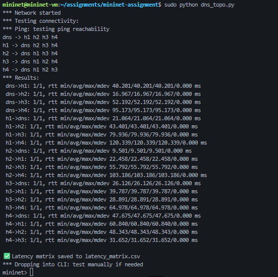

# CN: Assignment 2

- [CN: Assignment 2](#cn-assignment-2)
  - [Task: DNS Query Resolution](#task-dns-query-resolution)
    - [**_Setup_**](#setup)
    - [**A. Simulate the below given topology in Mininet and demonstrate successful connectivity among all nodes. (20 Points)**](#a-simulate-the-below-given-topology-in-mininet-and-demonstrate-successful-connectivity-among-all-nodes-20-points)
    - [**B. In the simulated topology, use the default host resolver to resolve the URLs specified in each host’s respective PCAP file, and record for each host the average lookup latency, average throughput, number of successfully resolved queries, and number of failed resolutions. (10 Points)**](#b-in-the-simulated-topology-use-the-default-host-resolver-to-resolve-the-urls-specified-in-each-hosts-respective-pcap-file-and-record-for-each-host-the-average-lookup-latency-average-throughput-number-of-successfully-resolved-queries-and-number-of-failed-resolutions-10-points)

**Team Details:**
Name | Roll Number
|---|---|
Romit Mohane | 23110279
Bhavya Parmar | -

## Task: DNS Query Resolution

### **_Setup_**

To Setup the assignment, we have used the **Mininet-VM** on Oracle VirtualBox. The setup was done by following instructions from [this](https://mininet.org/vm-setup-notes/) page. Then, we SSHed into the VM from our host system to write code and run commands.

### **A. Simulate the below given topology in Mininet and demonstrate successful connectivity among all nodes. (20 Points)**

<image src= 'images/topo.png' style= 'height:300px' />

The following script (`dns_topo.py`) was used to create and check the connections for the given topology.

```python
from mininet.topo import Topo
from mininet.net import Mininet
from mininet.node import OVSController
from mininet.link import TCLink
from mininet.cli import CLI
import csv

class DNSTopo(Topo):
    def build(self):

        # Hosts
        h1 = self.addHost('h1', ip='10.0.0.1/24')
        h2 = self.addHost('h2', ip='10.0.0.2/24')
        h3 = self.addHost('h3', ip='10.0.0.3/24')
        h4 = self.addHost('h4', ip='10.0.0.4/24')
        dns = self.addHost('dns', ip='10.0.0.5/24')

        # Switches
        s1 = self.addSwitch('s1')
        s2 = self.addSwitch('s2')
        s3 = self.addSwitch('s3')
        s4 = self.addSwitch('s4')

        # Host–Switch links
        self.addLink(h1, s1, bw=100, delay='2ms')
        self.addLink(h2, s2, bw=100, delay='2ms')
        self.addLink(h3, s3, bw=100, delay='2ms')
        self.addLink(h4, s4, bw=100, delay='2ms')

        # Switch–Switch links (core network)
        self.addLink(s1, s2, bw=100, delay='5ms')
        self.addLink(s2, s3, bw=100, delay='8ms')
        self.addLink(s3, s4, bw=100, delay='10ms')

        # DNS resolver link
        self.addLink(s2, dns, bw=100, delay='1ms')

def log_latencies(net):
    """Ping all host pairs and save results to CSV."""
    hosts = net.hosts
    csv_file = "latency_matrix.csv"

    with open(csv_file, 'w', newline='') as f:
        writer = csv.writer(f)
        # Header row
        header = ["Source/Destination"] + [h.name for h in hosts]
        writer.writerow(header)

        for src in hosts:
            row = [src.name]
            for dst in hosts:
                if src == dst:
                    row.append("—")  # no self-latency
                    continue
                # Ping once and extract average latency
                latency = src.cmd(f'ping -c 1 {dst.IP()} | tail -1 | cut -d"/" -f5').strip()
                row.append(latency if latency else "timeout")
            writer.writerow(row)

    print(f"\n✅ Latency matrix saved to {csv_file}")

if __name__ == '__main__':
    net = Mininet(topo=DNSTopo(), controller=OVSController, link=TCLink)
    net.start()
    print("*** Network started")
    print("*** Testing connectivity:")
    net.pingFull()
    log_latencies(net)
    print("*** Dropping into CLI: test manually if needed")
    CLI(net)
    net.stop()
```



This uses `pingFull` to display all the connection metrics as well. By running it with `sudo` we get:

We also get access to the mininet CLI from here, which can be used to check individual connections and run scripts on specific hosts. You can type `exit` to close the topology and CLI.

The latency matrix is as follows:
| Source/Destination | dns | h1 | h2 | h3 | h4 |
|--------------------|-------:|-------:|-------:|-------:|-------:|
| **dns** | — | 17.653 | 6.992 | 23.770 | 46.273 |
| **h1** | 17.848| — | 20.470 | 38.208 | 62.031 |
| **h2** | 7.590 | 19.783| — | 29.870 | 48.204 |
| **h3** | 24.067| 36.649| 26.144| — | 29.150 |
| **h4** | 46.017| 56.523| 50.763| 30.902| — |

To run commands from a specific node of the network, we can use the following syntax:

```bash
<node to execute command from> <command>
```

example:

```bash
h1 ping -c 2 dns
```

This pings the DNS node from H1 node for 2 packets.

### **B. In the simulated topology, use the default host resolver to resolve the URLs specified in each host’s respective PCAP file, and record for each host the average lookup latency, average throughput, number of successfully resolved queries, and number of failed resolutions. (10 Points)**

We first extracted the DNS queries from the respective PCAP files (stored in /pcap) to get the URLs to be resolved, using the command:

```bash
tshark -r pcap/PCAP_3_H3.pcap -Y "dns && udp.port == 53" -T fie
lds -e dns.qry.name > pcap/h3_domains.txt
```

Breakdown of the command:

| Part                       | Description                                                                                                              |
| -------------------------- | ------------------------------------------------------------------------------------------------------------------------ |
| tshark                     | Command-line version of Wireshark used for analyzing packet capture (PCAP) files.                                        |
| -r pcap/PCAP_3_H3.pcap     | Reads packets from the specified PCAP file corresponding to Host H3.                                                     |
| -Y "dns && udp.port == 53" | Display filter ensuring that only DNS packets (port 53) are processed, filtering out non-DNS traffic like LLMNR or mDNS. |
| -T fields                  | Specifies that only selected fields (not full packet details) should be printed.                                         |
| -e dns.qry.name            | Extracts the domain name field from each DNS query packet.                                                               |
| \> pcap/h3_domains.txt     | Redirects the extracted domain names into a text file for further processing.                                            |

This was repeated for all the pcap files, to get `h1_domains.txt`, `h2_domains.txt`, `h3_domains.txt` and `h4_domains.txt`.

Then, we used this script (`reolve_default.py`) to resolve the URLs using socket's `gethostbyname()`. The VM must be connected to the Internet through the Host, by using a NAT Adapter.

```python
import socket
import time
import csv

def resolve_domains(host_name, domain_file):
    results = []
    total_time = 0
    success = 0
    fail = 0

    with open(domain_file, 'r') as f:
        domains = [line.strip() for line in f if line.strip()]

    start_all = time.time()

    for domain in domains:
        start = time.time()
        try:
            socket.gethostbyname(domain)
            latency = (time.time() - start) * 1000  # ms
            results.append((domain, "SUCCESS", round(latency, 2)))
            success += 1
        except Exception:
            latency = (time.time() - start) * 1000
            results.append((domain, "FAIL", round(latency, 2)))
            fail += 1
        total_time += latency

    total_queries = len(domains)
    avg_latency = total_time / total_queries if total_queries else 0
    throughput = total_queries / (time.time() - start_all)

    # Save per-domain results
    csv_file = f"results/{host_name}_default_results.csv"
    with open(csv_file, 'w', newline='') as f:
        writer = csv.writer(f)
        writer.writerow(["Domain", "Status", "Latency (ms)"])
        writer.writerows(results)

    # Summary
    print(f"\n--- {host_name} ---")
    print(f"Queries: {total_queries}")
    print(f"Success: {success}")
    print(f"Failed: {fail}")
    print(f"Average latency: {avg_latency:.2f} ms")
    print(f"Throughput: {throughput:.2f} queries/sec")

    return {
        "host": host_name,
        "queries": total_queries,
        "success": success,
        "fail": fail,
        "avg_latency": avg_latency,
        "throughput": throughput
    }

if __name__ == "__main__":
    import os
    os.makedirs("results", exist_ok=True)

    hosts = {
        "H1": "pcap/h1_domains.txt",
        "H2": "pcap/h2_domains.txt",
        "H3": "pcap/h3_domains.txt",
        "H4": "pcap/h4_domains.txt"
    }

    summary = []
    for host, file in hosts.items():
        summary.append(resolve_domains(host, file))

    # Write overall summary
    with open("results/default_summary.csv", 'w', newline='') as f:
        writer = csv.writer(f)
        writer.writerow(["Host", "Total Queries", "Success", "Failed", "Avg Latency (ms)", "Throughput (qps)"])
        for row in summary:
            writer.writerow(row.values())
```

The detailed records for each Host can be found in `results/H1_default_results.csv`, `results/H2_default_results.csv`, `results/H3_default_results.csv` and `results/H4_default_results.csv` respectively. The summary of all the records can be found in `results/default_summmary.csv`. Also given below is the summary:

| Host | Total Queries | Success | Failed | Avg Latency (ms)   | Throughput (qps)   |
| ---- | ------------- | ------- | ------ | ------------------ | ------------------ |
| H1   | 100           | 71      | 29     | 6.572551727294922  | 151.97045450510464 |
| H2   | 100           | 66      | 34     | 3.297910690307617  | 302.44302023063034 |
| H3   | 100           | 72      | 28     | 3.4441041946411133 | 289.7475220576248  |
| H4   | 100           | 73      | 27     | 7.866830825805664  | 126.99671509894821 |

It should be noted that the latencies and throughput depend on that particular instants system performance (memory usage etc), since the VM's performace is impacted heavily sometimes.