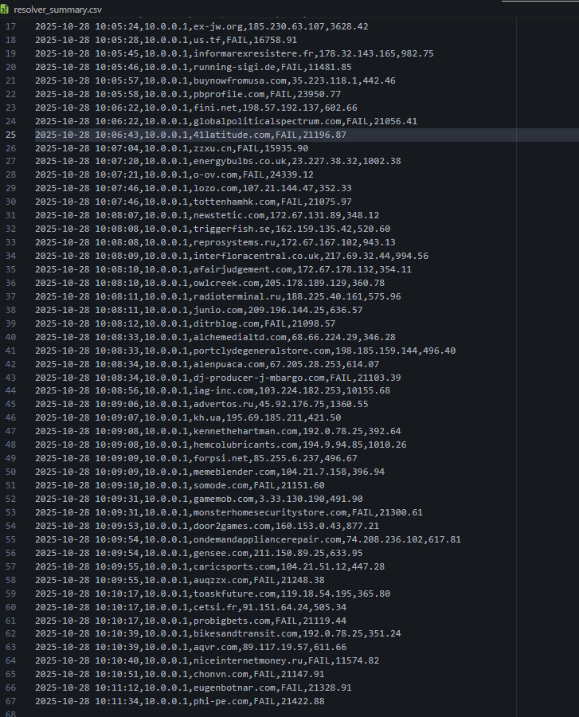
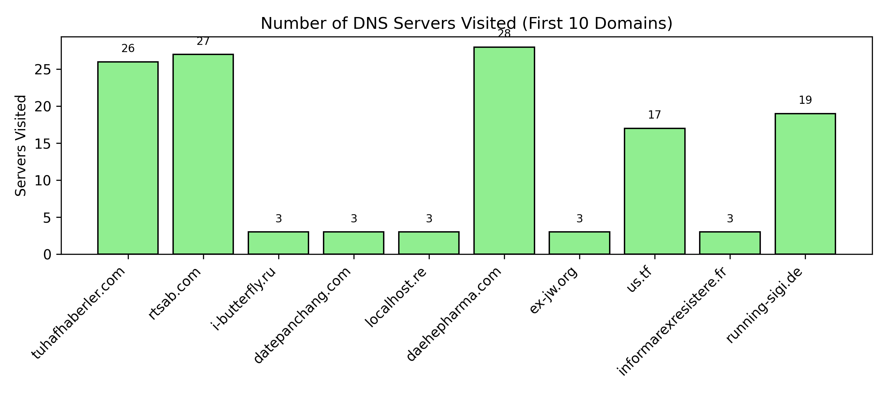
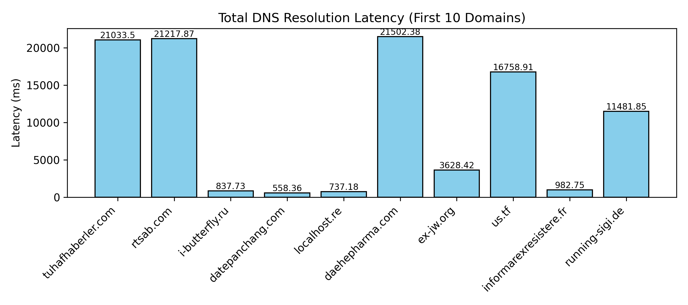

# CN: Assignment 2

- [CN: Assignment 2](#cn-assignment-2)
  - [Task: DNS Query Resolution](#task-dns-query-resolution)
    - [**_Setup_**](#setup)
    - [**A. Simulate the below given topology in Mininet and demonstrate successful connectivity among all nodes. (20 Points)**](#a-simulate-the-below-given-topology-in-mininet-and-demonstrate-successful-connectivity-among-all-nodes-20-points)
    - [**B. In the simulated topology, use the default host resolver to resolve the URLs specified in each host’s respective PCAP file, and record for each host the average lookup latency, average throughput, number of successfully resolved queries, and number of failed resolutions. (10 Points)**](#b-in-the-simulated-topology-use-the-default-host-resolver-to-resolve-the-urls-specified-in-each-hosts-respective-pcap-file-and-record-for-each-host-the-average-lookup-latency-average-throughput-number-of-successfully-resolved-queries-and-number-of-failed-resolutions-10-points)
    - [**C. Modify the DNS configuration of all Mininet hosts to use your custom resolver as the primary DNS server instead of the default system resolver. Show all the steps along with relevant screenshots. (10 Points)**](#c-modify-the-dns-configuration-of-all-mininet-hosts-to-use-your-custom-resolver-as-the-primary-dns-server-instead-of-the-default-system-resolver-show-all-the-steps-along-with-relevant-screenshots-10-points)
    - [**D. Repeat DNS resolution for the given PCAPs as done in part B, this time using your custom DNS resolver (10.0.0.5). Compare the results with those obtained in part B. Additionally, log the following in the custom DNS resolver:**](#d-repeat-dns-resolution-for-the-given-pcaps-as-done-in-part-b-this-time-using-your-custom-dns-resolver-10005-compare-the-results-with-those-obtained-in-part-b-additionally-log-the-following-in-the-custom-dns-resolver)
      - [Plots for H1 (first 10 URLs)](#plots-for-h1-first-10-urls)

**Team Details:**
Name | Roll Number
|---|---|
Romit Mohane | 23110279
Bhavya Parmar | -

## Task: DNS Query Resolution

### **_Setup_**

To Setup the assignment, we have used the **Mininet-VM** on Oracle VirtualBox. The setup was done by following instructions from [this](https://mininet.org/vm-setup-notes/) page. Then, we SSHed into the VM from our host system to write code and run commands.  
Remember to run the following command to bring up Internet connection in the VM.

```bash
sudo dhclient eth1
```

### **A. Simulate the below given topology in Mininet and demonstrate successful connectivity among all nodes. (20 Points)**

<image src= 'images/topo.png' style= 'height:300px' />

The following script (`dns_topo.py`) was used to create and check the connections for the given topology.

```python
from mininet.topo import Topo
from mininet.net import Mininet
from mininet.node import OVSController
from mininet.link import TCLink
from mininet.cli import CLI
import csv

class DNSTopo(Topo):
    def build(self):

        # Hosts
        h1 = self.addHost('h1', ip='10.0.0.1/24')
        h2 = self.addHost('h2', ip='10.0.0.2/24')
        h3 = self.addHost('h3', ip='10.0.0.3/24')
        h4 = self.addHost('h4', ip='10.0.0.4/24')
        dns = self.addHost('dns', ip='10.0.0.5/24')

        # Switches
        s1 = self.addSwitch('s1')
        s2 = self.addSwitch('s2')
        s3 = self.addSwitch('s3')
        s4 = self.addSwitch('s4')

        # Host–Switch links
        self.addLink(h1, s1, bw=100, delay='2ms')
        self.addLink(h2, s2, bw=100, delay='2ms')
        self.addLink(h3, s3, bw=100, delay='2ms')
        self.addLink(h4, s4, bw=100, delay='2ms')

        # Switch–Switch links (core network)
        self.addLink(s1, s2, bw=100, delay='5ms')
        self.addLink(s2, s3, bw=100, delay='8ms')
        self.addLink(s3, s4, bw=100, delay='10ms')

        # DNS resolver link
        self.addLink(s2, dns, bw=100, delay='1ms')

def log_latencies(net):
    """Ping all host pairs and save results to CSV."""
    hosts = net.hosts
    csv_file = "latency_matrix.csv"

    with open(csv_file, 'w', newline='') as f:
        writer = csv.writer(f)
        # Header row
        header = ["Source/Destination"] + [h.name for h in hosts]
        writer.writerow(header)

        for src in hosts:
            row = [src.name]
            for dst in hosts:
                if src == dst:
                    row.append("—")  # no self-latency
                    continue
                # Ping once and extract average latency
                latency = src.cmd(f'ping -c 1 {dst.IP()} | tail -1 | cut -d"/" -f5').strip()
                row.append(latency if latency else "timeout")
            writer.writerow(row)

    print(f"\n✅ Latency matrix saved to {csv_file}")

if __name__ == '__main__':
    net = Mininet(topo=DNSTopo(), controller=OVSController, link=TCLink)
    # nat = net.addNAT(name='nat0', connect='s2', ip='10.0.0.254/24').configDefault()
    net.start()
    print("*** Network started")
    print("*** Testing connectivity:")
    net.pingFull()
    log_latencies(net)
    print("*** Dropping into CLI: test manually if needed")
    CLI(net)
    net.stop()
```


This uses `pingFull` to display all the connection metrics as well. By running it with `sudo` we get:

We also get access to the mininet CLI from here, which can be used to check individual connections and run scripts on specific hosts. You can type `exit` to close the topology and CLI.

The latency matrix is as follows:
| Source/Destination | dns | h1 | h2 | h3 | h4 |
|--------------------|-------:|-------:|-------:|-------:|-------:|
| **dns** | — | 17.653 | 6.992 | 23.770 | 46.273 |
| **h1** | 17.848| — | 20.470 | 38.208 | 62.031 |
| **h2** | 7.590 | 19.783| — | 29.870 | 48.204 |
| **h3** | 24.067| 36.649| 26.144| — | 29.150 |
| **h4** | 46.017| 56.523| 50.763| 30.902| — |

To run commands from a specific node of the network, we can use the following syntax:

```bash
<node to execute command from> <command>
```

example:

```bash
h1 ping -c 2 dns
```

This pings the DNS node from H1 node for 2 packets.

### **B. In the simulated topology, use the default host resolver to resolve the URLs specified in each host’s respective PCAP file, and record for each host the average lookup latency, average throughput, number of successfully resolved queries, and number of failed resolutions. (10 Points)**

We first extracted the DNS queries from the respective PCAP files (stored in /pcap) to get the URLs to be resolved, using the command:

```bash
tshark -r pcap/PCAP_3_H3.pcap -Y "dns && udp.port == 53" -T fields -e dns.qry.name > pcap/h3_domains.txt
```

Breakdown of the command:

| Part                       | Description                                                                                                              |
| -------------------------- | ------------------------------------------------------------------------------------------------------------------------ |
| tshark                     | Command-line version of Wireshark used for analyzing packet capture (PCAP) files.                                        |
| -r pcap/PCAP_3_H3.pcap     | Reads packets from the specified PCAP file corresponding to Host H3.                                                     |
| -Y "dns && udp.port == 53" | Display filter ensuring that only DNS packets (port 53) are processed, filtering out non-DNS traffic like LLMNR or mDNS. |
| -T fields                  | Specifies that only selected fields (not full packet details) should be printed.                                         |
| -e dns.qry.name            | Extracts the domain name field from each DNS query packet.                                                               |
| \> pcap/h3_domains.txt     | Redirects the extracted domain names into a text file for further processing.                                            |

This was repeated for all the pcap files, to get `h1_domains.txt`, `h2_domains.txt`, `h3_domains.txt` and `h4_domains.txt`.

Then, we used this script (`reolve_default.py`) to resolve the URLs using socket's `gethostbyname()`. The VM must be connected to the Internet through the Host, by using a NAT Adapter. We set the nameserver to Google's DNS (`8.8.8.8`) using `h1 python -c "open('/etc/resolv.conf','w').write('nameserver 8.8.8.8\n')"`.

> We used Google DNS since we couldnt figure out a way to connect to the VM's default host resolver. The Mininet VM used systemd-resolved with a local stub (127.0.0.53) and upstream DNS (10.0.2.3). However, since 10.0.2.3 is part of the VM’s internal NAT network and unreachable from the Mininet virtual network (10.0.0.0/24), it could not be used directly by the Mininet hosts. Instead, a public DNS (8.8.8.8) was configured in each Mininet host’s /etc/resolv.conf to ensure external DNS resolution via the NAT gateway.

The script can be run on each host as such:

```bash
h1 python resolve_default.py H1
```

where you can replace h1/H1 with h2/H2, h3/H3 and h4/H4 respectively.

The detailed records for each Host can be found in `results/H1_default_results.csv`, `results/H2_default_results.csv`, `results/H3_default_results.csv` and `results/H4_default_results.csv` respectively. The summary of all the records can be found in `results/default_summmary.csv`. Also given below is the summary:

| Host | Total Queries | Success | Failed | Avg Latency (ms) | Throughput (qps) |
| ---- | ------------- | ------- | ------ | ---------------- | ---------------- |
| H1   | 100           | 71      | 29     | 166.42           | 6.01             |
| H2   | 100           | 68      | 32     | 110.20           | 9.07             |
| H3   | 100           | 72      | 28     | 131.48           | 7.6              |
| H4   | 100           | 73      | 27     | 120.46           | 8.3              |

It should be noted that the latencies and throughput depend on that particular instants system performance (memory usage etc), since the VM's performace is impacted heavily sometimes.

### **C. Modify the DNS configuration of all Mininet hosts to use your custom resolver as the primary DNS server instead of the default system resolver. Show all the steps along with relevant screenshots. (10 Points)**

To modify the DNS configuration of all hosts from `h1 → default system resolver → external DNS servers` to `h1 → 10.0.0.5 (custom resolver) → external servers (Google/Root/etc.)`:

1. Start the topology:

```bash
sudo python dns_topo.py
```

2. Inside the mininet CLI, we can verify the nodes and their IP addresses using: `<node> ifconfig`.
3. We start running the custom DNS resolver we built in the previous assignment, using

```bash
dns python custom_dns.py &
```

_(The '&' runs it in the background. To check, you can run `dns ps`)_

4. Now, we will configure the hosts to use our custom DNS server:

```bash
h1 python -c "open('/etc/resolv.conf','w').write('nameserver 10.0.0.5\n')"
```

This will set the nameserver to `10.0.0.5`, which all hosts can now use.

We can check for the changes using `cat` command to open the file.


### **D. Repeat DNS resolution for the given PCAPs as done in part B, this time using your custom DNS resolver (10.0.0.5). Compare the results with those obtained in part B. Additionally, log the following in the custom DNS resolver:**

-   **Timestamp**
-   **Domain name queried**
-   **Resolution mode**
-   **DNS server IP contacted**
-   **Step of resolution (Root / TLD / Authoritative / Cache (if caching implemented))**
-   **Response or referral received**
-   **Round-trip time to that server**
-   **Total time to resolution**
-   **Cache status (HIT / MISS) (if caching implemented)**

**For PCAP_1_H1, present graphical plots for the first 10 URLs, showing the total number of DNS servers visited and latency per query.**

To let the Mininet nodes access the internet: Enable IP forwarding on the VM

```bash
sudo sysctl -w net.ipv4.ip_forward=1
```

And, uncomment the line `nat = net.addNAT(name='nat0', connect='s2', ip='10.0.0.254/24').configDefault()` in `dns_topo.py`. This connects nat0 to the Mininet topology (via s2) and to the VM’s external interface (eth1), providing Internet access.

To test DNS resolution:

```bash
h1 dig example.com
```
The resolver logs can be found in `resolver_detailed_steps.csv` and `resolver_summary.csv`. 

We also have some random/leaky DNS queries from internal applications, as shown below:


Now, you can use the following command to resolve the URLs form the PCAPs (Repeat Part B):
```bash
h1 python resolve_custom.py H1
```
where you can replace h1/H1 with h2/H2, h3/H3 and h4/H4 respectively.

Then, you can see the logs live in the `csv` files mentioned above.



#### Plots for H1 (first 10 URLs)
**Pure Iterative Server**


